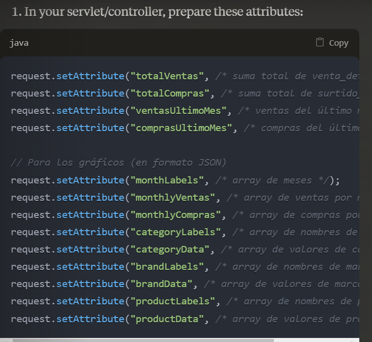

# Documentación para el backend

## Página de Login
La página de login envía los siguientes datos: usuario y contraseña. Estos datos se envían a un servlet llamado `auth`. Si los datos son correctos, se redirige a `JSP/inicio.jsp`; de lo contrario, se redirige a la página de login enviando un parámetro llamado `loginError`, cuyo valor será `"error"`.

## Encabezado (header.jsp)
El encabezado es un formulario que, dependiendo del botón que se presione, enviará un valor al servlet. Este valor será igual a la página activa en ese momento. El servlet recibirá este valor y, dependiendo del valor que reciba, devolverá algunos valores al frontend de la siguiente manera:

### 1. Página Activa: Historial Ventas Compras
Si `activePage = "historial-ventas-compras"`, se deben retornar al frontend dos arrays o conjuntos de valores:

- **Compras**: En el modelo relacional están guardadas como `"surtidos"`. Los valores a retornar al fronted incluyen:
  - `id_surtido`
  - `nombre del producto`
  - `cantidad`
  - `total`
  - `nit_proveedor`
  - `fecha_entrega`
  - (Datos contenidos en tres tablas diferentes).

- **Ventas**: Los datos de ventas incluyen:
  - `id_venta`
  - `nombre del producto`
  - `cantidad`
  - `total`
  - `fecha_hora`
  - (Datos contenidos en tres tablas diferentes).

### 2. Página Activa: Productos
Si `activePage = "productos"`, se deben retornar al frontend los siguientes campos:

- `id_producto`
- `nombre del producto`
- `nombre de la marca`
- `nombre de la categoría`
- `unidades (stock)`
- `precio unitario`
- (Datos provenientes de tres tablas diferentes).

### 3. Página Activa: Panel Control
Si `activePage = "panel-control"`, se debe retornar al frontend:

- Una **sumatoria total** del campo `total` de la tabla `venta_detalle`.
- Una **sumatoria total** del campo `total` de la tabla `surtido_detalle`.
- Sumatorias del campo `total` tabto en la tabla `venta_detalle` como en la tabla `surtido_detalle`, ambas **agrupadas por mes**.
- Cálculos de las **cinco categorías de productos más vendidos** (en términos absolutos) hasta la fecha.
- Cálculos de las **cinco marcas más vendidas** hasta la fecha.
- Cálculo de los **cinco productos más vendidos** (retornando el nombre de esos productos).
- **Ventas totales del último mes**.
- **Compras (surtidoS) del último mes**.

## Página: Agregar Venta
La página `agregar-venta` tiene un formulario donde se pide el `id` del producto y la `cantidad`. Se pueden añadir varios productos con sus respectivas cantidades. Los datos se envían al backend (`ventas`), donde se realiza:

1. **Insert en la tabla venta**: Solo se necesita obtener la fecha actual, ya que `id_venta` es autoincremental.
2. **Insert en la tabla venta_detalle**: Cada producto es una fila, donde se insertan `id` y `cantidad` y se calcula el total de esa venta (usando un join con la tabla productos y su campo `precio unitario`).
3. **Actualización en tabla productos**: Se disminuye el campo `cantidad` en la tabla productos por cada producto vendido.

## Página: Agregar Compra
La página `agregar-compra` tiene un formulario donde se solicita el `id` del producto, la `cantidad` y el `nit` del proveedor (solicitado una sola vez por compra o surtido). Pueden añadirse varios productos con sus respectivas cantidades. Los datos se envían al backend (`compras`), donde se realiza:

1. **Insert en la tabla surtido**.
2. **Insert en las tablas surtido_detalle y estado_surtido**.
3. **Actualización en tabla productos**: Se incrementa el campo `cantidad` en la tabla productos por cada producto adquirido.

## Página: Productos
La página `productos` contiene dos formularios:

1. El primer formulario envía al backend (`busqueda-individual`) un `id_producto` y retorna los siguientes campos al frontend:
   - `id_producto`
   - `nombre del producto`
   - `nombre de la marca`
   - `nombre de la categoría`
   - `unidades (stock)`
   - `precio unitario`

2. El segundo formulario envía un “stock-mínimo” al backend y retorna al frontend los mismos datos del primer formulario para todos los productos que cumplan con el filtro.

## Nota
Para todo será necesario usar **procesos almacenados**.

## Anexos
Esto es para cuando se vayan a enviar los datos al panel de control

